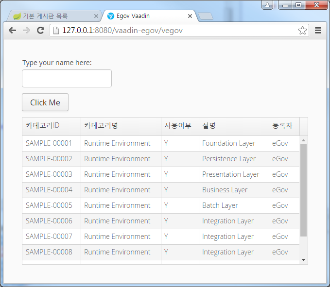

:book-link: http://www.basakpie.com

=  Jinson Book of Vaadin Examples(egov)

== Overview

{book-link}[Jinson Vaadin Book] appendix1. egov example

=== Vaddin Egov Web

== Building from source

requires eGovFrameDev-3.5.1-64bit

requires Vaadin Framework 7.6.5+

* Maven Build

[source,groovy,indent=0]
----
mvn clean install
----

* Maven WAS Start

[source,groovy,indent=0]
----
mvn jetty:run
----

native egov view : http://127.0.0.1:8080/vaadin-egov

vaadin egov view : http://127.0.0.1:8080/vaadin-egov/vegov

